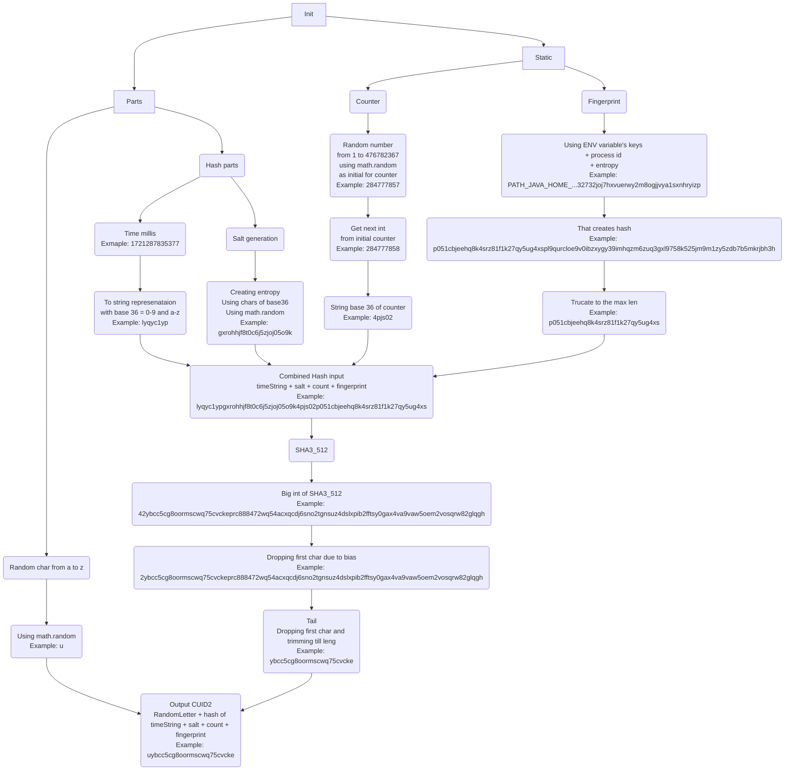

# cuid2

Next generation guids.
Secure, collision-resistant ids optimized for horizontal scaling and
performance.

Original author and reference: https://github.com/paralleldrive/cuid2

# package

```shell
go get github.com/akshayvadher/cuid2
```

## usage

```go
package main

import (
	"fmt"
	"github.com/akshayvadher/cuid2"
)

func main() {
	id := cuid2.CreateId()
	fmt.Println(id)
	// to create default length id
	// us1hfvvf2uyzmh031bav6skw

	idWithLength := cuid2.CreateIdOf(10)
	// zev57ezp7c

	createId := cuid2.Init(customRandomFunction, customCounterFunction, length, customFingerprintString)
	createId()
	// this generates id with custom parameters
}
````

###

# cli

```shell
go install github.com/akshayvadher/cuid2/cmd/cuid2@latest
```

## usage

```shell
cuid2
# wldu51x7wn6baulkeq49qfm7

cuid2 -n 5
# generates 5 ids
# s7dseq8y5ti85c02eptzia1p
# wz4rk8nj39dpyd01gddsp9rz
# kwezj4wa69d6ta7jxg3b6lnz
# pzuju2hk01xpev6ixnnnsqba
# enxpfer2u7c00xa24li0jghc

cuid2 -len 10
# generates id with length 10
# h8crfzyp6q

cuid2 -n 3 -len 11
# generates 3 ids with length 11
# ijlk68norem
# redx1s0adbb
# mk5zg8dxgi1

cuid2 validate 123
# not a valid CUID2 "123"

cuid2 validate qf9183tmebd
# Valid CUID2 "qf9183tmebd"
```

# understanding

